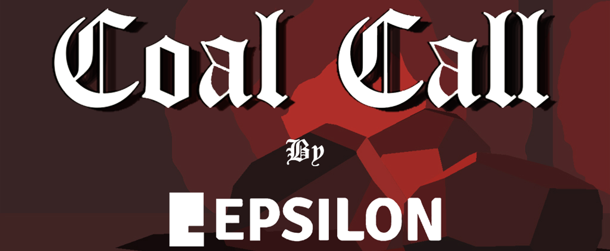
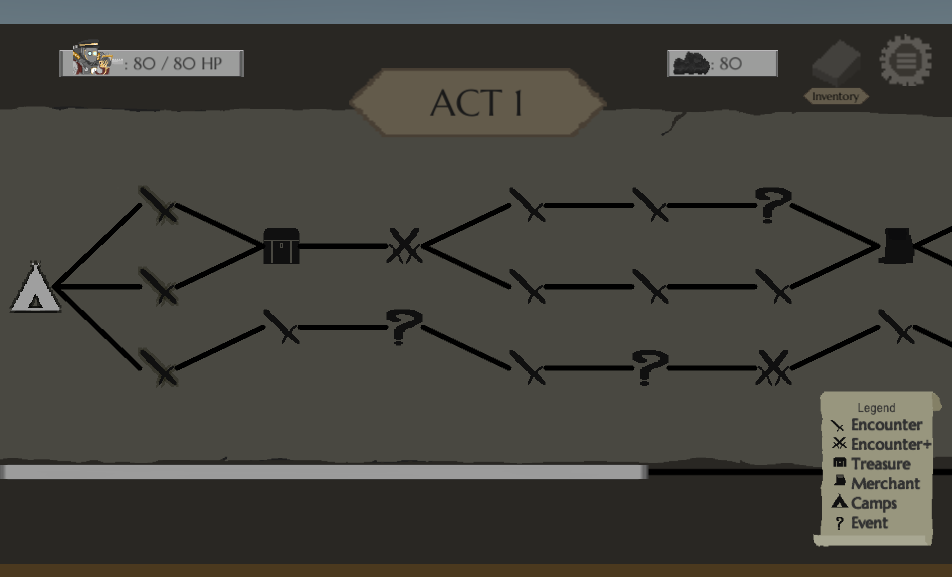
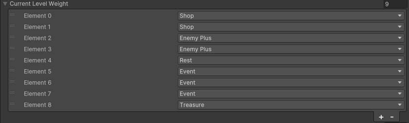
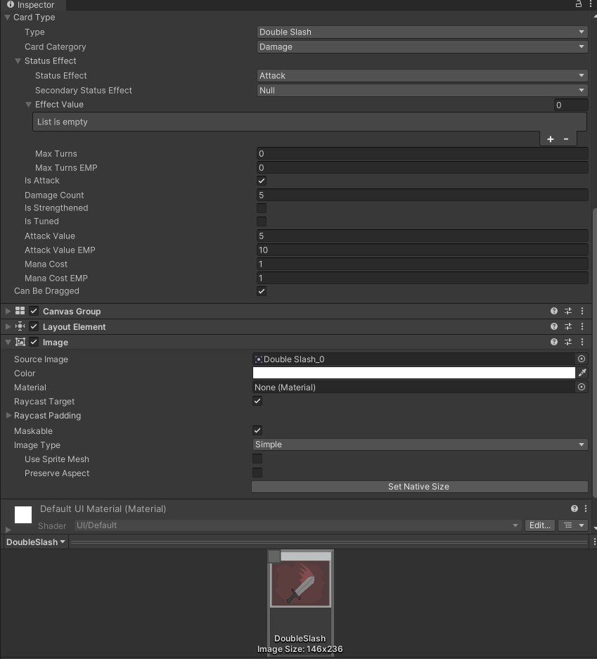
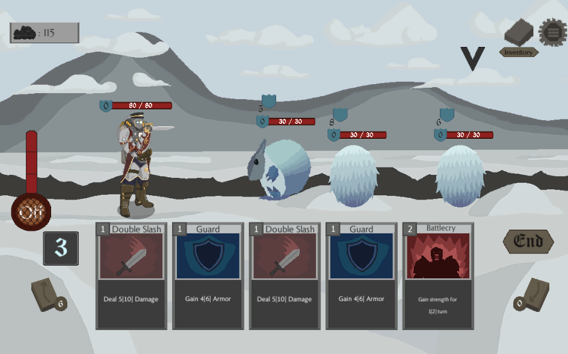
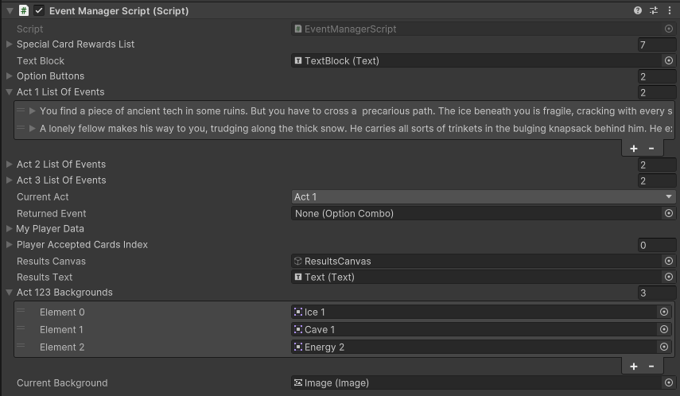
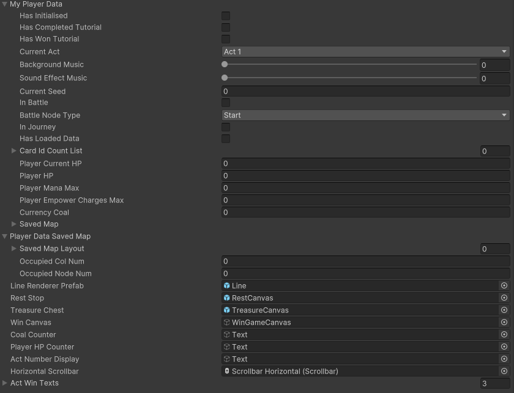
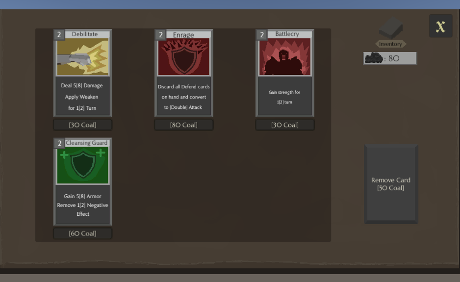

<link rel="stylesheet" href="style.css"></link>

<!--- Directory --->

  
Drag me

## [Back to home page](index.md)

or check out the game below!

<iframe src="https://itch.io/embed/996400?dark=true" width="552" height="167" frameborder="0"><a href="https://uowmgames.itch.io/coal-call">Coal Call by UOWM Game Development, rend.exe, s34nn, miragelix</a></iframe>

</img>

# Coal Call

is a roguelike deck-builder game, strategize the use of Empowerment during battles, gain card rewards and coal by defeating monsters and discover new locations and events as you continue your search for coal in a land swept by eternal winter.

Eternal winter has swept the land, temperatures plunge, and the old way of life is all but lost. Coal has become the most valuable resource. Small communities need it to power their settlements but monsters that have arisen from the cold consume it to survive. Early on, you find an ancient suit of armour with advanced offensive and defensive capabilities, powered by a miniature version of the Stirling Engine, and became the protector of the village. As the village’s supply of coal is dwindling fast, you set out to find a new source of coal for the village amidst the tundra or so you thought…

### Category

PC, Group Project, Unity, 2021

## **My Contributions**

For Coal Call, I was in charge of being a gameplay and game systems programmer.

This was the first group project in Unity for our course in UOWM KDU, where we learnt how to cooperate in a team comprised of students from different majors to produce a project.

A lot of the systems in this project involve tweaking variables in the editor on a specific manager game object.

## Branch progression map

The project was inspired by STS, and one of the few things I wanted to make was the map with multiple paths, branch-style. 

hover to enlarge

</img>

Designers will to tweak what events were available at that stage, and how many was allowed to occur in a stage.

hover to enlarge

</img>

## Other contributions

I also helped to design the class for the cards used as well as enemy values alongside the use cases defined by our designers. It affects the turn-based card battles, the Empower effect, and status effects in the battle gameplay loop.

hover to enlarge

</img>

hover to enlarge

</img>

I also contributed were player data saving, it was intimidating as it was a first major project for me to save the necessary player data and load from it. Minor contributions also included GUIs, events system, and shops.

hover to enlarge

</img>

hover to enlarge

</img>

hover to enlarge

</img>

---