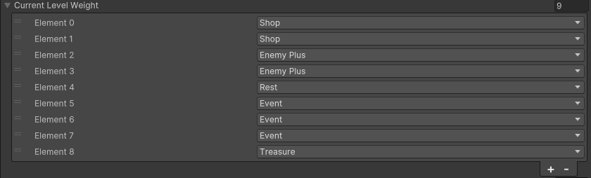
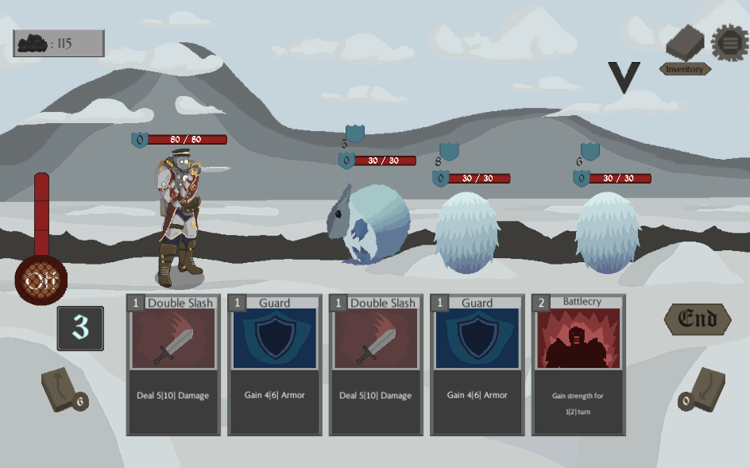

<head>
  <meta name="robots" content="index,follow" />
  <meta name="language" content="English" />
  <meta name="revisit-after" content="1 day" />
  <meta name="keywords" content="portfolio, gamedev, game, game dev, game development, gabriel kwa, gabrielkwa, kwagabriel, kwa gabriel, malaysia, programmer" />  
  <meta name="viewport" content="width=device-width, initial-scale=1.0" />
  <meta name="title" property="og:title" content="Gabe's Portfolio" />
  <meta name="type" property="og:type" content="website" />
  <meta name="url" property="og:url" content="https://kwagabriel.github.io" />
  <meta name="image" property="og:image" content="https://kwagabriel.github.io/assets/media/images/repository-open-graph-gabe.png" />
  <meta name="author" content="Gabriel Kwa" />
  <meta name="description" property="og:description" content="Check out my works on game systems design and implementation here." />
  <link rel="stylesheet" href="assets/css/style.css" />
  <link rel="shortcut icon" type="image/png" href="{{ 'assets/media/images/favicon.png' | absolute_url }}" />
  <link rel="shortcut icon" type="image/x-icon" href="assets/media/images/favicon.png" />
  <link rel="icon" type="image/png" href="{{ 'assets/media/images/favicon.png' | absolute_url }}" />
  <link rel="icon" type="image/x-icon" href="assets/media/images/favicon.png" />
</head>

<!--- Directory --->

  
Drag me

## [Back to home page](index.md)

or check out the game below!

<iframe src="https://store.steampowered.com/widget/3193310" width="100%" height="50%" frameborder="0"><a href="https://store.steampowered.com/app/3193310/Deadly_Rehearsal/">Deadly Rehearsal by Kaigan Games</a></iframe>

# Deadly Rehearsal

is a 3D first-person narrative puzzle horror game where you play as Dodger, a disgraced stage manager hired by a prestigious director to perform a cursed play. The rehearsal is plagued with gruesome accidents and nightmarish visions. To save the cast and yourself, you must master the art of stagecraft and confront evils behind the curse.

The only way to break the curse is to finish it with everyone intact. 

### Category

Kaigan Games, PC, Unity, 2023, 2024, 2025

## **My Contributions**

For Deadly rehearsal, I was in charge of general gameplay programming, UI, and editor toolmaking. I was also responsible for integrating addressables and shaders.

This project was a very eye opening experience, where I got to learn a lot from my senior programmer in terms of coding practices and ways of thinking.

The entire game development pipeline was very clear in this project, and I enjoyed working with the team on this game.

## Controller support
## Inspect Item UI Gizmo
## Addressable asset loading
## QOL Editor tools 

## Branch progression map

The project was inspired by STS, and one of the few things I wanted to make was the map with multiple paths, branch-style. 

hover to enlarge

Designers will to tweak what events were available at that stage, and how many was allowed to occur in a stage.

hover to enlarge

## Other contributions

I also helped to design the class for the cards used as well as enemy values alongside the use cases defined by our designers. It affects the turn-based card battles, the Empower effect, and status effects in the battle gameplay loop.

hover to enlarge

hover to enlarge

I also contributed were player data saving, it was intimidating as it was a first major project for me to save the necessary player data and load from it. Minor contributions also included GUIs, events system, and shops.

hover to enlarge

hover to enlarge

hover to enlarge

---