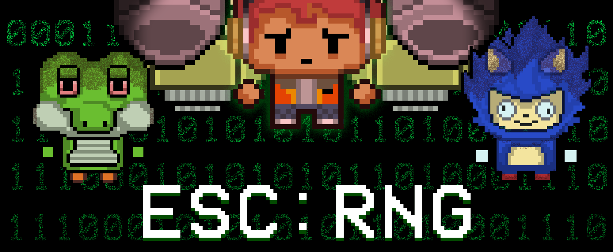

<head>
  <meta name="robots" content="index,follow" />
  <meta name="language" content="English" />
  <meta name="revisit-after" content="1 day" />
  <meta name="keywords" content="portfolio, gamedev, game, game dev, game development, gabriel kwa, gabrielkwa, kwagabriel, kwa gabriel, malaysia, programmer" />  
  <meta name="viewport" content="width=device-width, initial-scale=1.0" />
  <meta name="title" property="og:title" content="Gabe's Portfolio" />
  <meta name="type" property="og:type" content="website" />
  <meta name="url" property="og:url" content="https://kwagabriel.github.io" />
  <meta name="image" property="og:image" content="https://kwagabriel.github.io/assets/media/images/repository-open-graph-gabe.png" />
  <meta name="author" content="Gabriel Kwa" />
  <meta name="description" property="og:description" content="Check out my works on game systems design and implementation here." />
  <link rel="stylesheet" href="assets/css/style.css" />
  <link rel="shortcut icon" type="image/png" href="{{ 'assets/media/images/favicon.png' | absolute_url }}" />
  <link rel="shortcut icon" type="image/x-icon" href="assets/media/images/favicon.png" />
  <link rel="icon" type="image/png" href="{{ 'assets/media/images/favicon.png' | absolute_url }}" />
  <link rel="icon" type="image/x-icon" href="assets/media/images/favicon.png" />
</head>

<!--- Directory --->

  
Drag me

## [Back to home page](index.md)

or check out the game below!

<iframe allow="autoplay" src="https://itch.io/embed/1491579?border_width=0&amp;dark=true" width="100%" height="100%" frameborder="0"><a href="https://uowmgames.itch.io/escrng">Esc:RNG by UOWM Game Development</a></iframe>

# Esc:RNG

is a 2D pixel roguelike shooter where a group of gacha game players left poor reviews of a gacha game, which caused the developers to trap them inside the game to witness their suffering. In a game universe made by egoistic, incompetent, magic-wielding developers, the players will have to find their way out to return to their normal world by fighting enemies in the buggy game.

### Category

PC, Group Project, Unity, FYP, 2022

## **My Contributions**

For Esc:RNG, I was in charge of being a gameplay and game systems programmer.

The team came to an agreement that our project required lots of repetitive work after the game systems were built, therefore I made in-editor tools for this project for the designers to tweak to their needs.

## Procedural Dungeon asset tool

hover to enlarge

One of the tools was for Zelda-style procedural dungeon generation.

hover to enlarge

It uses the built-in tilemap from Unity and allows for parameter tweaking. It allows the designers to make, save, and define generation rules for the room when the game generates the dungeons.

## Other tools

Aside from that, a tool was also made for weapon gacha and weapon crafting rules.

hover to enlarge

I made the tools based on requirements from the game design document while making use of scriptable objects.

hover to enlarge

While unpublished, there was also a UnityEvents system tool integrating scriptable objects, this was planned to be used should development of the game continue past the required assignment.

hover to enlarge

## Other Contributions

Other things I contributed were keybinding settings using JSON, as well as modifying the plugin scripts used, to suit our use case.

---