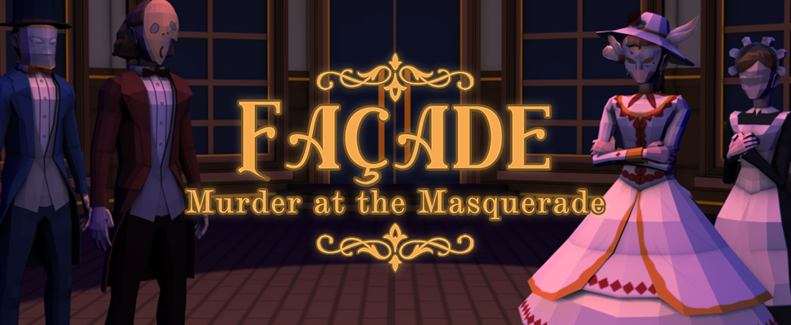
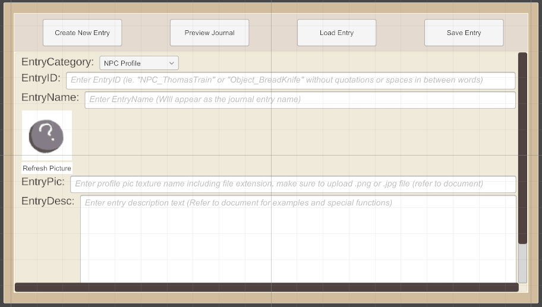
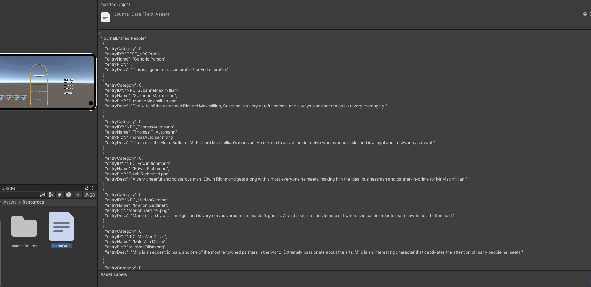
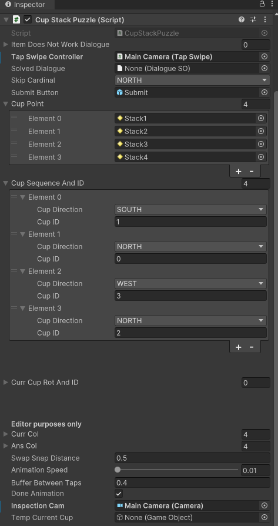
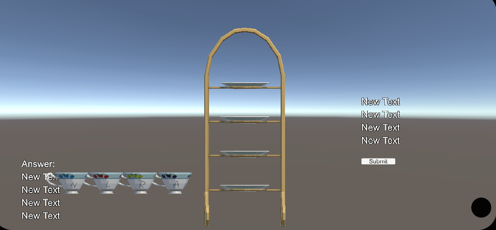

<head>
  <meta name="image" property="og:image" content="assets/media/images/repository-open-graph-gabe.png">
  <meta name="author" content="Gabriel Kwa">
  <meta name="title" property="og:title" content="Gabe's Portfolio">
  <meta name="description" property="og:description" content="Check out my works on game systems design and implementation here.">
  <link rel="stylesheet" href="assets/css/style.css"/>
  <link rel="shortcut icon" type="image/png" href="{{ 'assets/media/images/favicon.png' | absolute_url }}">
  <link rel="shortcut icon" type="image/x-icon" href="assets/media/images/favicon.png">
</head>

<!--- Directory --->

  
Drag me

## [Back to home page](index.md)

or check out the game below!

<iframe src="https://itch.io/embed/1162355?dark=true" width="100%" height="100%" frameborder="0"><a href="https://uowmgames.itch.io/facade-murder-at-the-masquerade">Façade: Murder At The Masquerade by UOWM Game Development, JYGL, NorthWestSouth, cosmickatsu, Nazaza, rend.exe, CalebFoo, ICH0RR, FloW75, Tan Xinyi</a></iframe>

# Façade: Murder at the Masquerade

is a 3D point-and-click murder mystery where no one is to be trusted. A murder has occurred at the Maximillian Mansion! As the local detective, the player investigates the murder at the mansion in a point-and-click puzzle game. Players would investigate the mansion for clues and interrogate suspects to uncover the truth behind the mansion owner’s death.

### Category

Android, Group Project, Unity, 2022

## **My Contributions**

For Façade, I was in charge of being a puzzle and game systems programmer.

Due to the designers on the team not being as familiar with Unity, instead of being involved in directly modifying the game’s assets, I suggested that an application was used to fill in the assets in the game, with only the necessary elements being exposed, like certain texts, image assets etc. 

## Journal entry asset tool

One of the tools made was made in Unity and the data was serialised into JSON using the same class used in the game. 

hover to enlarge

Once the designers deemed the content to be suitable it will just be a single folder to drag and drop into the game’s asset directory. This was used for our game’s journal entries which the player can access in game corresponding to the clues obtained. 

hover to enlarge

Looking back, the implementation was just a normal data class rather than a scriptable object class, which would definitely be suitable for this use case.

## Teacup puzzle mechanic

For the puzzle, I was responsible for the tea cup placement puzzle, using lerp for location and rotation, I was able to complete this puzzle fairly straightforward-ly. 

hover to enlarge

I then used the render texture system made by a team member to have it display as an overlay when engaged in the puzzle action.

hover to enlarge

## Other contributions

Other things I contributed were player data saving, but the directory in mobile devices was less accessible and accessing it via script functions differently than it does in PC applications, it took a few tries but it worked fine in the end. Minor contributions also included GUIs.

---