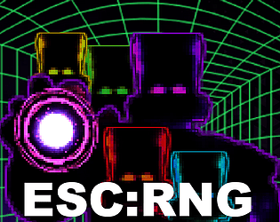
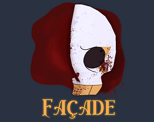
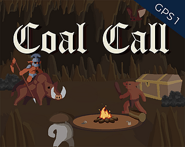

<link rel="stylesheet" href="assets/css/style.css"/>
<link rel="shortcut icon" type="image/png" href="{{ '/assets/media/images/favicon.png' | absolute_url }}">

<head>
      <meta property="og:image" content={/assets/media/images/repository-open-graph-gabe} />
      <meta name="og:image" content={/assets/media/images/repository-open-graph-gabe} />
</head>

<!--- UI -->

<!--- Directory --->

Drag me

## Table of contents

- ### [Intro](#gabes-portfolio)

- ### [Education](#section-education)

- ### [Experience](#section-experience)

- ### [Programming language](#section-programminglanguage)

- ### [Game Projects](#section-gameprojects)

- ### [Socials and other links](#section-socialsandotherlinks)

  <video class="videobanner-player" src="assets/media/videos/banner.mp4" type="video/mp4" autoplay loop muted></video>

# Gabe’s Portfolio

## I am Gabriel,

a game dev from UOWM KDU.

I have been acquainted with Unity throughout my course completing solo and team projects alike. For my final year project, I was part of Studio Reroll that made Esc:RNG as a general game programmer.
I have also been doing UE related projects during my internship at Nimbus Games.
Please drop me an email if there are any questions or for further discussion, I look forward to hearing from you!

### [View my resume here](assets/documents/ResumeCV.pdf)

### [View socials and other links](#socials-and-other-links)

#  Education

## University of Wollongong Malaysia KDU

Bachelor of Games Development (Hons) - Game Tech | CGPA 3.8

#  Experience

## [Nimbus Games](https://nimbusgames.dev/)

Intern Game Programmer | Nov 2022 - May 2023

#  Programming language

## Proficiency in descending order

- C++
- C#
- Java
- Python
- Js + HTML + CSS

#  Game Projects

- ## Esc:RNG

is a 2D pixel roguelike shooter where a group of gacha game players left poor reviews of a gacha game, which caused the developers to trap them inside the game to witness their suffering. In a game universe made by egoistic, incompetent, magic-wielding developers, the players will have to find their way out to return to their normal world by fighting enemies in the buggy game.

### [Devlog](EscRNG.md)

### Category

PC, Group Project, Unity, FYP, 2022

- ## Façade: Murder at the Masquerade

is a 3D point-and-click murder mystery where no one is to be trusted. A murder has occurred at the Maximillian Mansion! As the local detective, the player investigates the murder at the mansion in a point-and-click puzzle game. Players would investigate the mansion for clues and interrogate suspects to uncover the truth behind the mansion owner’s death.

### [Devlog](Facade.md)

### Category

Android, Group Project, Unity, 2022

- ## Coal Call

is a roguelike deck-builder game, strategize the use of Empowerment during battles, gain card rewards and coal by defeating monsters and discover new locations and events as you continue your search for coal in a land swept by eternal winter.

### [Devlog](CoalCall.md)

### Category

PC, Group Project, Unity, 2021

- ## Stance Stance Revolution

is a mobile game exercise integrating Firebase to allow for user credential registration, login, and a competitive leaderboard in this souls-inspired dodging game.

### [Devlog is Archived]()

### Category

Android, Solo Project, Unity, 2021

- ## Parkor Knihgt

is an endless runner where you play as a knight-dude in shining armour running through a hazardous collapsing valley, parkour over obstacles to earn extra points, which can be used to learn more parkour actions, to earn more points. Earn the most points before succumbing to your mistakes.

### [Devlog is Archived]()

### Category

Android, Solo Project, Unity, 2021

- ## Honster Munter

is a text-input RPG with ascii GUI, where you play one of three monsters, getting your revenge on hunters overstepping their bounds in nature. Explore the world, fight hunters in a turn based battle, learn skills, use items and defeat the hunter’s guild to avenge your fallen kin.

### [Devlog is Archived]()

### Category

Console App, Solo Project, Unity, 2020

- ## Neon Adderall

is a PC typing game. Earn the most points possible while maintaining the highest WPM to increase your point multiplier.

### [Devlog is Archived]()

### Category

PC, Solo Project, Unity, 2020

- ## Neon Cigarette

is a platformer set in a cliche cyberpunk setting, you wake up in a cigarette factory with no recollection of how you got there. Make use of items you obtain throughout the locale to fight and platform your way out of the bad guy ridden factory.

### [Devlog is Archived]()

### Category

Flash, Solo Project, Stencyl, 2020

- ## Cyberponk 2001

is a pong game with character selection and powerups, featuring PVP and PVC game modes.

### [Devlog is Archived]()

### Category

Flash, Solo Project, Stencyl, 2020

- ## Taste Buds

is a tabletop card game where you compete against other players by serving up one of many dishes based on what ingredients are available to you. The more complex the dish, the more points earned.

### [Devlog is Archived]()

### Category

Tabletop, Group Project, 2020

#  Socials and other links

<!-- - ### [Esc:RNG](EscRNG.md)
    
- ### [Façade: Murder at the Masquerade](Facade.md)
    
- ### [Coal Call](CoalCall.md) -->

- ### [Click to view my resume here](assets/documents/ResumeCV.pdf)

- ### [LinkedIn page](https://www.linkedin.com/in/gabrielkwa)

- ### [itch.io page](https://rendexe.itch.io)

- ### [Send me an email here](mailto:kwagabriel011206@gmail.com)

---

  

    

  

